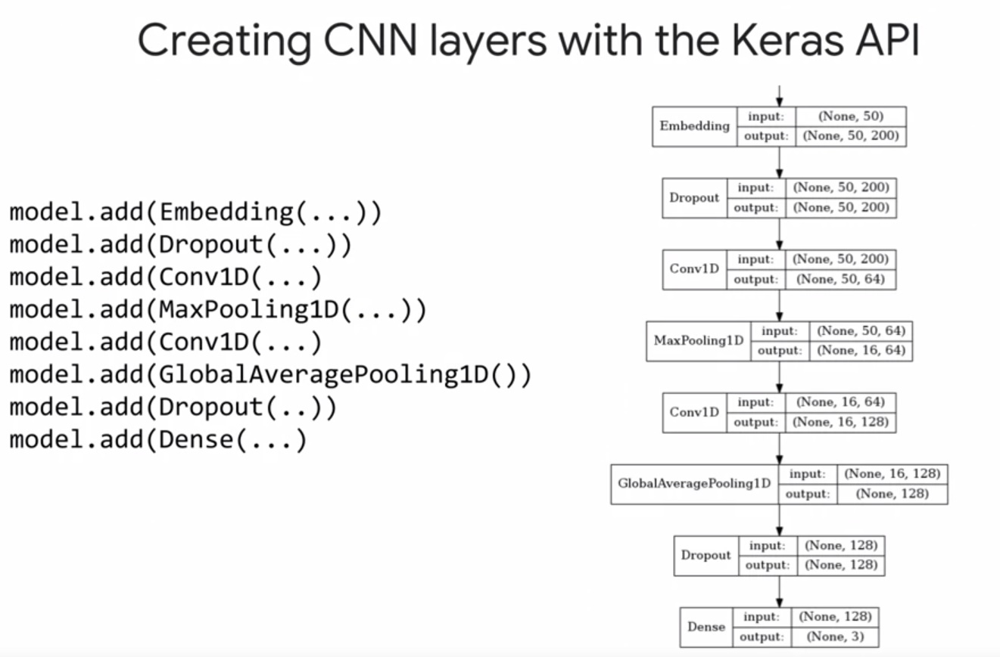

# GCP time series and NLP

## Contents

[***LSTM,GRU,RNN in TensorFlow***](https://github.com/Sylar257/GCP-time-series-and-NLP#Basic_models): primal approaches for modeling time-series data.

[***Building NLP models with Keras***](https://github.com/Sylar257/GCP-time-series-and-NLP#Building_NLP_models_with_Keras): bringing data to the cloud

[***TensorFlow Hub***](https://github.com/Sylar257/GCP-time-series-and-NLP#TensorFlow_Hub): a collection of pre-trained machine learning models and reusable modules

[***Encoder-Decoder_networkds***](https://github.com/Sylar257/GCP-time-series-and-NLP#Encoder-Decoder-networks): often used in tasks such as language translation, question answering and text summarization

[***AutoML and DialogFlow***](https://github.com/Sylar257/GCP-time-series-and-NLP#AutoML_and_DialogFlow): A useful library that deal with all kinds of tensor-to-tensor problem setups


## Basic_models

The basic concepts of LSTM, GRU, and vanilla RNNs could be found in my [other repos](https://github.com/Sylar257?tab=repositories). Here we will focus on their implementation on GCP with TensorFlow:

```python
# pre-determine cell state size
CELL_SIZE = 32

# 1. Choose RNN Cell type
cell = tf.nn.rnn_cell.GRUCell(CELL_SIZE) # BasicLSTMCell: LSTM; BasicRNNCell: vanilla rnn

# 2. Create RNNby passing cell and tensor of features(x)
outputs, state = tf.nn.dynamic_rnn(cell, x, dtype=tf.float32) # x needs shape: [BATCH_SIZE, MAX_SEQUENCE_LENGTH, INPUT_DIM]
# state has shape: [BATCH_SIZE, CELL_SIZE]

# 3. Pass rnn state through a DNN to get prediction
h1 = tf.layers.dense(state, DNN, activation=tf.nn.relu)
pretidtions = tf.layers.dense(h1, 1, activation=None) #(BATCH_SIZE, 1)

return predictions
```

## Building_NLP_models_with_Keras



If we want to use `Keras` for its fast prototyping properties. Bear in mind that `Keras` does not support distributed training itself.

An common way to solve this problem is to convert `Keras` models to `tf.estimator`

```python
model = models.Squential()

# define models architecture here
...

# compile model
model.compile(...)

# convert to estimator
estimator = keras.estimator.model_to_estimator(keras_model=model)
```

Steps for deploy `Keras` model in the `text_classification.ipynb` Jupyter notebook:

* Transform text into sequence of integers
* Pad sequences to a constant length
* Convert Kera model to `tf.estimator`
* Instantiate `tf.estimator`
* Train and Deploy model using **Cloud ML Engine**

```python
def keras_estimator(model_dir,
                    config,
                    learning_rate,
                    filters=64,
                    dropout_rate=0.2,
                    embedding_dim=200,
                    kernel_size=3,
                    pool_size=3,
                    embedding_path=None,
                    word_index=None):
    # Create model instance.
    model = models.Sequential()
    num_features = min(len(word_index) + 1, TOP_K)

    # Add embedding layer. If pre-trained embedding is used add weights to the
    # embeddings layer and set trainable to input is_embedding_trainable flag.
    if embedding_path != None:
        embedding_matrix = get_embedding_matrix(word_index, embedding_path, embedding_dim)
        is_embedding_trainable = True  # set to False to freeze embedding weights

        model.add(Embedding(input_dim=num_features,
                            output_dim=embedding_dim,
                            input_length=MAX_SEQUENCE_LENGTH,
                            weights=[embedding_matrix],
                            trainable=is_embedding_trainable))
    else:
        model.add(Embedding(input_dim=num_features,
                            output_dim=embedding_dim,
                            input_length=MAX_SEQUENCE_LENGTH))

    model.add(Dropout(rate=dropout_rate))
    model.add(Conv1D(filters=filters,
                              kernel_size=kernel_size,
                              activation='relu',
                              bias_initializer='random_uniform',
                              padding='same'))

    model.add(MaxPooling1D(pool_size=pool_size))
    model.add(Conv1D(filters=filters * 2,
                              kernel_size=kernel_size,
                              activation='relu',
                              bias_initializer='random_uniform',
                              padding='same'))
    model.add(GlobalAveragePooling1D())
    model.add(Dropout(rate=dropout_rate))
    model.add(Dense(len(CLASSES), activation='softmax'))

    # Compile model with learning parameters.
    optimizer = tf.keras.optimizers.Adam(lr=learning_rate)
    model.compile(optimizer=optimizer, loss='sparse_categorical_crossentropy', metrics=['acc'])
    estimator = tf.keras.estimator.model_to_estimator(keras_model=model, model_dir=model_dir, config=config)

    return estimator
```

## TensorFlow_Hub

TensorFlow Hub is a library for the publication, discovery, and consumption of reusable parts of machine learning models. A module is a self-contained piece of a TensorFlow graph, along with its weights and assets, that can be reused across different tasks in a process known as transfer learning, which we covered as part of the course on Image Models.

To download and use a module:

```python
import tensorflow as tf
import tensorflow_hub as hub

with tf.Graph().as_default():
  module_url = "path/to/hub/module"
  embed = hub.Module(module_url)
  embeddings = embed(["word1", "word2", "word3"])
  # ...
  
  # .... earlier code
  with tf.Session() as sess:
    sess.run(tf.global_variables_initializer())
    sess.run(tf.tables_initializer())
    print(sess.run(embeddings))
```

TensorFlow Hub has modules for **images**, **text**, and **Video**. It usually come with links to the original papers where the model in question was proposed.

## Encoder-Decoder-networks

There are many useful techniques in Encoder-Decoder network applications such as **Beam search** and **attention**. You will find useful interpretation and code implementations in [this repo](https://github.com/Sylar257/Image-Captioning-Project) and [this repo](https://github.com/Sylar257/Transformers-in-NLP). Here we will focus on the `TensorFlow` implementation on **GCP**:


If we are interested in add **attention mechanism** to our `GRUCell`s, it’s as simple as instantiate the attention mechanism and put a wrapper on the `GRUCell`:


There is a trick of adding **Dropout layers** to an architecture—**list comprehension**:

```python
# create one GRUCell for each layer
cells = [tf.nn.rnn_cell.GRUCell(CELLSIZE) for _ in range(NLAYERS)]
# Dropout wrapper
cells = [tf.nn.rnn_cell.DropoutWrapper(cell, output_keep_prob=pkeep) for cell in cells]

# create multiRNNCell
mcell = tf.nn.rnn_cell.MultiRNNCell(cells, state_is_tuple=False)

# the forward loop
Hr, H = tf.nn.dynamic_rnn(mcell, X, initial_state=Hin)
```


## AutoML_and_DialogFlow


### DialogFlow

DialogFlow is an **end-to-end** developer platform for building natural and rich conversational experiences.

There are three main components:

* **Intents**: **actions** that a user wants to take
* **Entities**: are the **nouns** in your dialog
* **Context**：helps the chatbot to keep track

**Intents** represent a **mapping** between *what the user says* to *what action should be taken by the catbot*. 

**Entities** are the objects that we want to **act upon**. They help us get to the **specifies** of an interaction. Entities usually help our chatbot to decide what details it need to know and how it should react. Entities are also a great way to add **personalizations** to a chatbot. We can use an entity and data stored in a database to remember details about a user such as their name or favorite drink.

**Context** is required for the chatbot to refer back to previous knowledge and give an appropriate answer.

